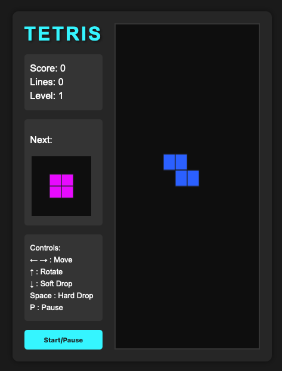

# Vanilla JS Tetris

A classic Tetris game implementation using pure JavaScript, HTML5 Canvas, and CSS without any external libraries or frameworks.



## 🎮 Demo

You can play the game directly [here](https://vanilla-js-tetris.vercel.app) (add your deployment link once available).

## ✨ Features

- Complete Tetris gameplay mechanics
- Score tracking system
- Level progression (speed increases)
- Line clearing and scoring
- Next piece preview
- Game pause functionality
- Responsive design
- Keyboard controls

## 🛠️ Technologies Used

- Vanilla JavaScript (ES6+)
- HTML5 Canvas API
- CSS3
- No external libraries or frameworks

## 🕹️ How to Play

### Controls

- **←/→ Arrow Keys**: Move piece left/right
- **↑ Arrow Key**: Rotate piece
- **↓ Arrow Key**: Soft drop (faster fall)
- **Space Bar**: Hard drop (immediate placement)
- **P**: Pause/Resume game

### Scoring

- 1 line: 40 × level
- 2 lines: 100 × level
- 3 lines: 300 × level
- 4 lines: 1200 × level

## 🚀 How to Run Locally

1. Clone this repository:

   ```
   git clone https://github.com/trzaskos/vanilla-js-tetris.git
   ```

2. Navigate to the project directory:

   ```
   cd vanilla-js-tetris
   ```

3. Open `index.html` in your browser.

No build process or dependencies required!

## Known Bugs

- Tetromino pieces don't fully reach the right edge of the game board. This is a known limitation in the current implementation that will be addressed in future versions.

## 📝 Future Improvements

- [ ] Mobile touch controls
- [ ] Sound effects
- [ ] High score persistence using localStorage
- [ ] Animated line clears
- [ ] Hold piece functionality
- [ ] Different difficulty modes

## 🤝 Contributing

Contributions are welcome! Feel free to open an issue or submit a pull request.

1. Fork the project
2. Create your feature branch (`git checkout -b feature/AmazingFeature`)
3. Commit your changes (`git commit -m 'Add some AmazingFeature'`)
4. Push to the branch (`git push origin feature/AmazingFeature`)
5. Open a Pull Request

## 📄 License

This project is licensed under the MIT License - see the [LICENSE](LICENSE) file for details.

## 🙏 Acknowledgements

- The original Tetris game created by Alexey Pajitnov
- Various Tetris guidelines that have evolved over the years

---

Feel free to fork this project and make your own improvements!

## 📧 Contact

Maryele Trzaskos Gruber - [maryele.trzaskos@gmail.com](mailto:maryele.trzaskos@gmail.com)

Project Link: [https://github.com/trzaskos/vanilla-js-tetris](https://github.com/trzaskos/vanilla-js-tetris)

## ☕ Support

If you find this project helpful, consider buying me a coffee!

<a href="https://www.buymeacoffee.com/trzaskos" target="_blank">
  
</a>
